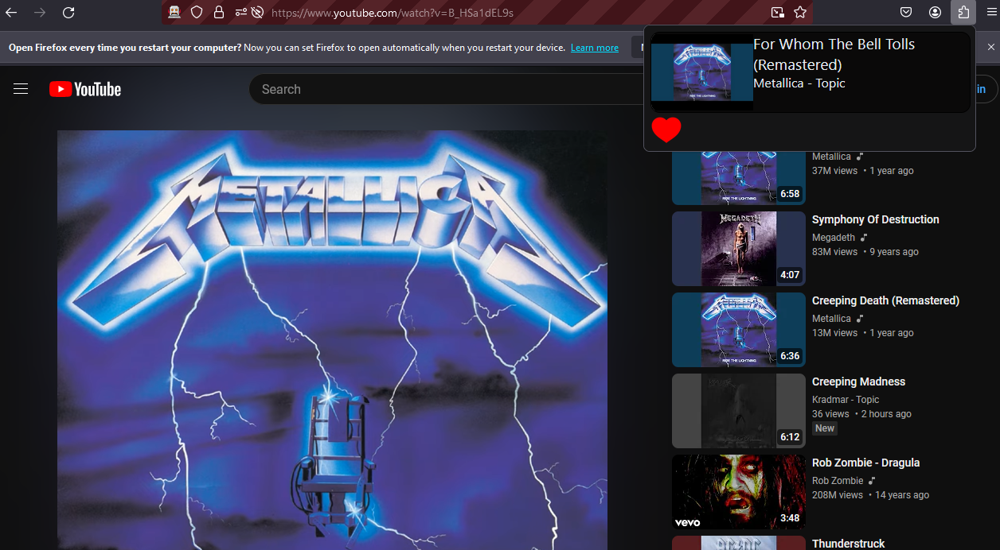

# Ghost-Scrobbler

A simple scrobbler extension for firefox aimed at youtube/youtube music users!

## Building

### Requirements
- npm
- yarn
- webpack
- web-ext
- typescript

### Steps
On your terminal run the following under `/ghostscrobbler/`
1. `$ npx tsc`
2. `$ npx webpack --config webpack.config.js `

#### Testing the extension
`web-ext run --devtools`

#### Building it

`web-ext build`

## Roadmap

- [x] Implement auth process
- [x] Implement scrobbling
- [x] Add love/unlove functionality
- [ ] Implement discord rich presence
- [ ] Implement track correction
- [x] Improve GUI
